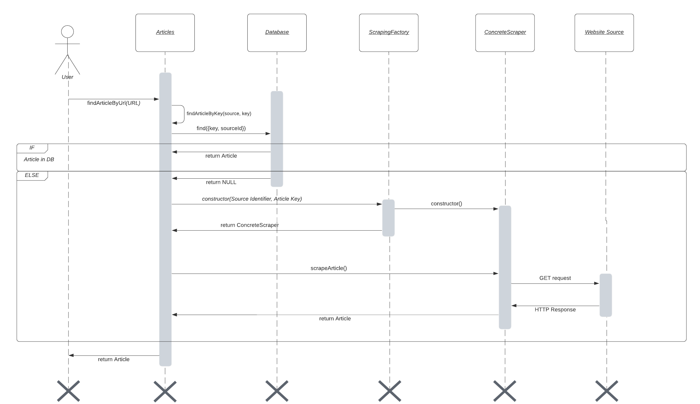

# Models

This module contains all Mongoose models which implement easy database access and provide us with validation, lifecycle (e.g. pre-save, pre-validate) hooks along with custom static function and instance methods.

In this readme you will see a brief documentation on each model as well as UML diagrams that explain the flow of data in what we call the `pipeline`.

Further documentation going into explanations of instance variables, methods, code implentation details and types can be found in the respective module folder.

## Why Mongoose

Initial requirement analysis suggested that a Document Oriented Database might be the way to go. As the project progressed and as the scope and idea increased and matured, it became clear that his was not necessarily the case. Due to the timeframe of the project, we decided to continue with the database in mind. We had little concern for the fact that a relational database might be more efficient, as the size of the dataset is not expected to grow in the millions, or billions of records per collection. Rather it was the fact that we might have benefitted from the relational model in the development of this project, for example key constraints.

MongoDB does, however, work exceptionally well in our case. And Mongoose's easy validation, lifecycle hooks, well documented interface and seamless TypeScript support has really had a positive impact on the speed of development.

## Models and the folder structure

The model folder structure is relatively simple. Each model is its own module, with an `index.ts` file which contains the model definition. Interfaces, static methods, instance methods, and utils are kept in their own file in order to maintain readability.

    .
    ├── Answers               # Answers model
    ├── Questions             # Questions model
    ├── Users                 # example of a Model folder
    │   │   ├── __test__      # test folder
    |   |   └── ...           # 0..N folders with local logic
    │   ├── index.ts          # index file with schema and model definition
    │   ├── interface.ts      # interfaces declared for TS support
    │   ├── methods.ts        # instance methods defined here
    │   ├── statics.ts        # model static functions defined here
    │   └── utils.ts          # utilities for the model
    ├── ...                   # ... other models
    └── README.md

### Users

The users model contains information about the users of our platform.

### Questions

The questions model contains information about user submitted questions and their state in the `pipeline`.

### Answers

The questions model contains information about user submitted answers and their state in the `pipeline`.

### Articles

Articles is a cache/store of articles that we have scraped online. Our policy is to not store the article unless there is a reference to one in other database models which depend on the article to remain unchanged. For example if we have an `Answers` instance which claims that there is an answer to a `Questions` instance in the Wikipedia page for Barack Obama in words 3-7 in paragraph 18, it is obvious that if the article changes in its source the `Answers` instance information becomes incorrect.

### Article Sources

An article source is a website that contains articles which we can scrape. An example would be Wikipedia. To see information on how to add new Article sources and how to add scrapers for a new article source see documentation [here](https://github.com/cadia-lvl/qa-crowdsourcing-api/blob/main/src/models/Articles/ScrapingService/readme.md).

### Game Rounds

TODO: fill out

### Auth Tokens

TODO: fill out

## The Pipeline

TODO: fill out

## Getting Articles

TODO: fill out

## Google Search

TODO: fill out
TODO: add image

## Reset Password

TODO: fill out
TODO: add image

## Register

TODO: fill out
TODO: add image
